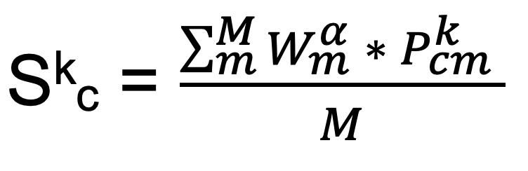

.. _CAWPE:

⚖️ CAWPE 
=================

CAWPE calculation consists of three key components:
  1. Individual method performance assessment
  2. Individual method training and cell class confidence prediction
  3. Consensus calculation
  
1. Individual method performance assessment
------------
The Individual method performance assessment is performed by running the :ref:`config_benchmarking` pipeline.
The output of this pipeline consisted in a vector W of size m (#methods), where Wm represents the performance of method m.

2. Individual method training and cell class confidence prediction
------------
The Individual method performance assessment is performed by running the :ref:`config_annotation` pipeline.
As a result, for each cell k we obtained a probability matrix Pk of size m x c (methods by cells), where Pkij  represents the probability of cell k belonging to class i as determined by the method j.

3. Consensus calculation
------------
The ensemble mapping score is calculated combining the individual methods predictions (Pk) and their performance scores (W). 
This is done in the last step of the :ref:`config_annotation` pipeline.
We define the CoRAL score for a class c in cell k as:

where α is a hyperparameter that controls the contribution of the performance to the final score. For values above 1, this hyperparameter increases the impact of differences in performance, allowing methods with a clear aptitude for a given scenario to contribute more significantly to the ensemble prediction, while ensuring that these methods can still be overruled when enough other methods disagree.
To see the original publication where CAWPE is proposed visit the `Original CAWPE publication <https://link.springer.com/article/10.1007/s10618-019-00638-y>`_ for more information.
To see how CoRAL score is computed using ontologies see :ref:`ontology`.