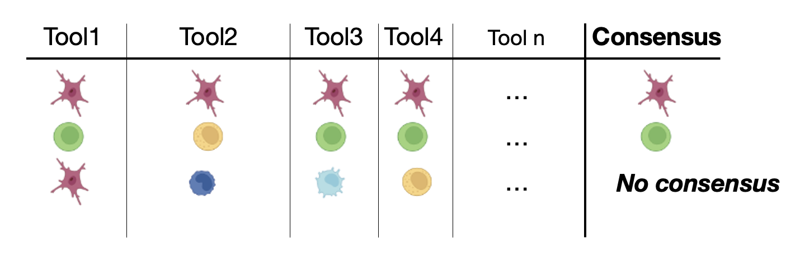

.. _majority_vote:

🗳️ Majority Vote 
=================

The consensus using the majority vote consisted in the Relative Majority, this means that the final cell class will be assigned as the class with the most agreement.
If the final results consist in a tied the cell will be labeled as **No Consensus**.
If the final agreement is lower than the :code:`min_agreement` value specified by the user will be labeled as **No Consensus**.
In case of using an ontology, cell classes are converted to its broader class before doing the compute the consensus.

