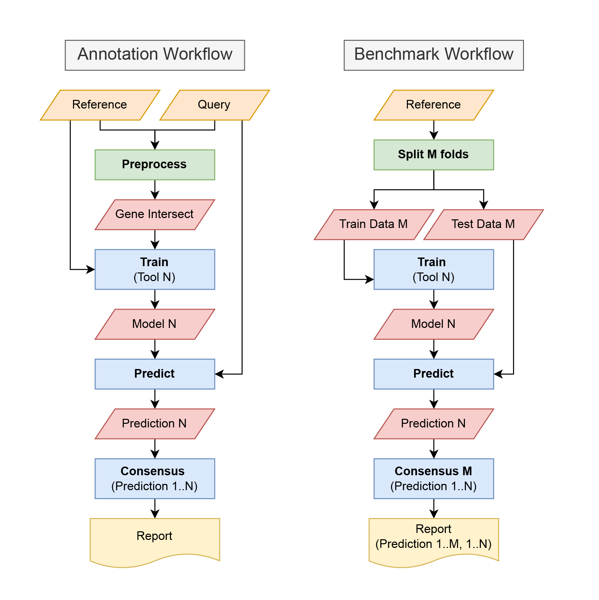

scCoAnnotate
===================================

**scCoAnnotate** is an snakemake pipeline for consensus prediction of cell types in single-cell RNA sequencing (scRNA-seq) data. The pipeline allows users to run up to 15 different reference-based annotation tools (statistical models and machine learning approaches) to predict cell type labels of multiple scRNA-seq samples. It then outputs a consensus of the predictions, which has been found to have increased accuracy in benchmarking experiments compared to the individual predictions alone, by combining the strengths of the different approaches.

The pipeline is automated and running it does not require prior knowledge of machine learning. It also features parallelization options to exploit available computational resources for maximal efficiency. This pipeline trains classifiers on genes common to the reference and all query datasets.

Two different workflows can be run as part of scCoAnnotate. The annotation workflow takes both a references data set and query samples with the aim of annotating the query samples. The benchmarking workflow takes only the reference and preforms a M fold cross validation.

Check out the :doc:`usage` section for further information, including
how to :ref:`quickstart` the project.

.. note::

   This project is under active development.

Contents
--------

.. toctree::
   :maxdepth: 1
   Quickstart
   usage
   api
