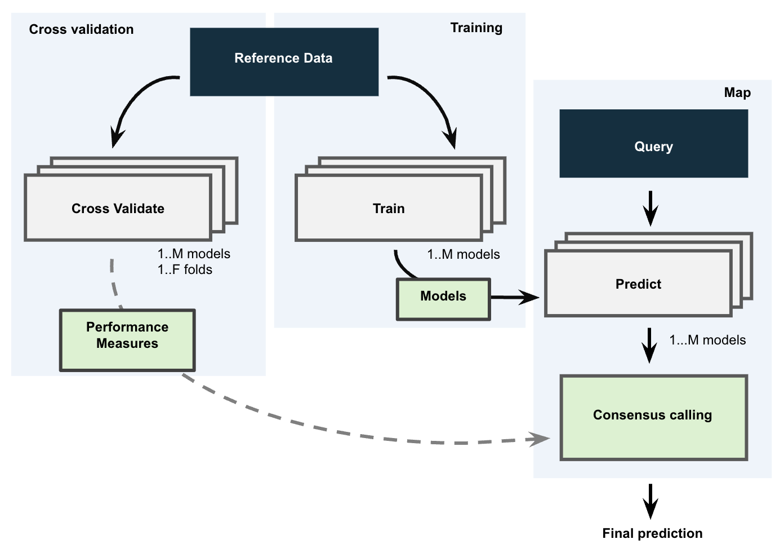
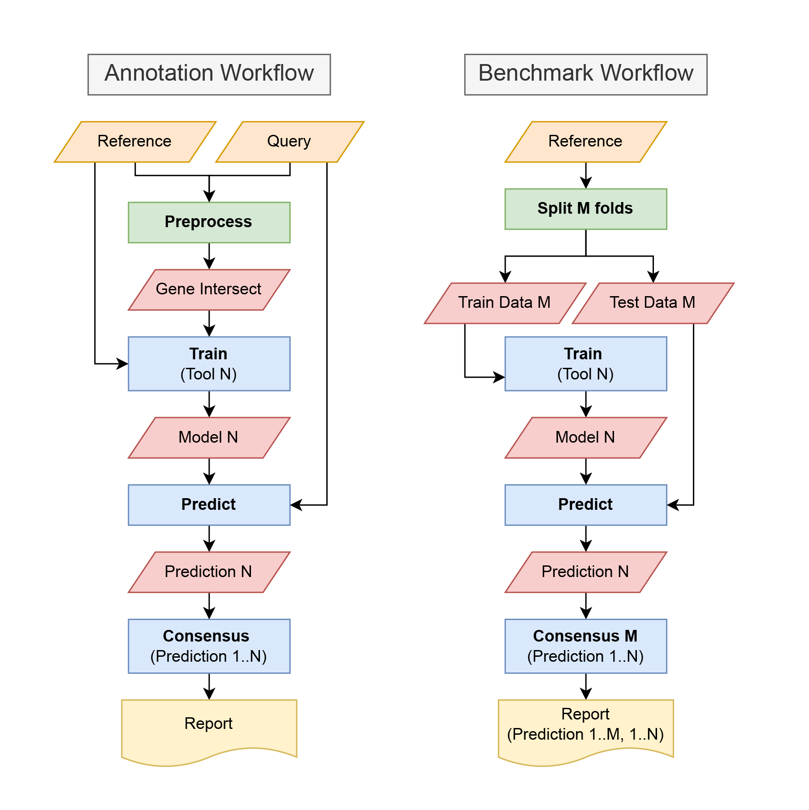

CoRAL: Consensus Reference-based Automated Labeling
============

**CoRAL** is a mapping method based-on ensemble learning to measure technical and biological distances between references and query.
CoRAL is built on Snakemake. The pipeline allows users to run up to 19 different reference-based annotation methods, representing a diverse set of statistical models and machine learning approaches, to map labels from single cell reference data to the query data. The pipeline outputs the results of each individual method as well as a cell x cell type matrix with a weighted consensus based-on performance (CAWPE) score for each reference cell type in the query.

The pipeline is automated and running it does not require prior knowledge of machine learning or coding in either R or Python. We provide an apptainer/dockerdocker image which has all the necessary dependencies installed. The pipeline features parallelization options through snakemake, which allows the user to utilize available computational resources on HPC clusters.
CoRAL architecture consists of three key components: (1) individual method performance assessment (Benchmarking Workflow), (2) individual method training and cell class confidence prediction (Pretrained and Annotation Workflow), and (3) ensemble learning.

Pipelines structures:

Check out the original publication XXX for further information including
how to :ref:`quickstart` the project.

.. note::

   This project is under active development.

Contents
--------

.. toctree::
   :maxdepth: 2
   
   Tutorial/tutorial
   Quickstart/quick_start
   Features/index
   Config/index
   Consensus_methods/index
   Pretrain/index
   Tools/index
   FAQ
